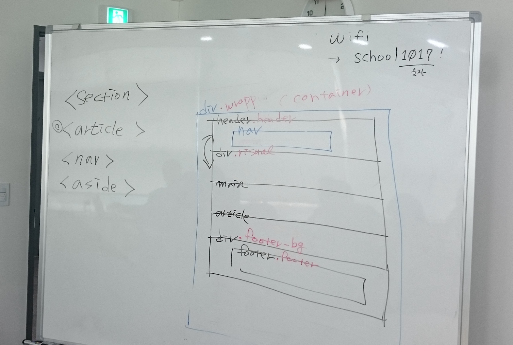

# 180514 - 5일차 강의 요약

## 인터넷 서비스
- 텔넷(원격 접속 서비스), E-MAIL, Usenet(관심 그룹 커뮤니티), FTP(파일 송수신 프로토콜), IRC(메신져), Archie(검색), Gopher(검색) 
- -> WWW으로 통합되어가고 있음

*** 웹이 어떻게 태어났고 어떤 역사를 가지고 어떻게 발전해왔는지 관심을 가지자! `` 김데레사 강사님 ``

*** 한 분야에 깊이 있게 공부해보자 !! 풀스택이라는 단어 극혐!! `` 김데레사 강사님 ``


*** 취업에 급급하기보다 4개월 동안 좋은 개발자로 성장할 수 있는 자양분을 얻어가자는 마인드를 가지자 `` 김데레사 강사님 ``

## WWW
- World Wide Web
- Who?(누가 만들었나?) 팀 버너스 리 가 만듬_ 웹의 아버지
- Why? 지리적으로 멀리 떨어진 사람들을 묶기 위해서
- Wonder World 온라인과 오프라인을 넘나들며 원더월드를 창조하고자 하는 욕구 뿜뿜 !!

## WEB
- Back - Application Layer, Database, Server
- Front - Presentation Layer, Web Browser, Client

## Front-End
- HTML5, CSS3, Javascript
## HTML
- 건강한 신체
- 구조적으로 만들어 볼 것
## CSS
- 근사한 스타일링
## Javascript
- 스마트한 두뇌


## 웹표준
- WorldWIdeWeb Consortiums
- 요즘은 Vender 가 주도해서 웹표준을 이끌어감 ( 구글, MS, 애플, 모질라, 오페라 )

 ** 제프리 젤드만의 웹표준 가이드 읽어보세요 !!

## 웹접근성
- 웹의 힘은 그것의 보편성에 있다.
- 누구에게나 사용가능한 웹을 만들자
- 특정 사용자를 배제하지는 않았는지 고민해보자


—————————————————————

## 부가기능 설치
크롬, 파이어폭스
``` 
도구 더보기 - 크롬 웹스토어 이동 후 설치

Web Developer
Headingsmap
Open Wax (* 크롬전용)
Viewport Resizer 

```
VS code
```

Live server 설치
fontsize 자유
minimap false
tab size 2
```
—————————————————————
```
HTML5 -> 최신 표준
이전 표준을 살펴봄

XML -> Extensive markup lang
모든 명령태그는 생략을 허용하지 않고 종료되어야함
소문자는 허용하지 않는다.

https://emmet.io/

독타입 - 문서의 종류를 정의하는 명령어
```
<br>
——————————오후———————————
<br>

Gecko Reflow Visualization
[기존 파이어폭스의 리플로우 과정](https://www.youtube.com/watch?v=ZTnIxIA5KGw)
```
마크업은 컨텐츠에 의미를 부여하는것

눈에 보이지 않더라도 제목 레벨의 태그를 적절하게 사용해야함
-> SEO 를 고려했을때도 좋음

구조설계는 디자인과 따로 바라봐야함, 컨텐츠의 성격에 따라서 결정

API -> 가져다 쓸 수 있게 만들어 둔 함수덩어리

HTML5 의 기본 서식은 4.01과 1.0의 문법을 모두 허용함
-> 하지만 일관성을 가진 규칙을 바탕으로 작업하길 권장

SEO를 높이려면 -> 타이틀에 쓸 데 없는 문구 쓰지말 것 (ex. ###환영합니다.###)
```
———————————————————————
```
code 라인 삭제 commend + k
code 라인 옮기기 option + 방향키
```
———————————————————————
```
MainContent
mainContent -> 카멜케이스
main-content -> 케밥케이스
main_content -> 언더스코어케이스
```
———————————————————————




- \<head>


```
<meta> 태그는 빈 요소이다. 각각 어떤 attribute가 들어갔는지에 따라서 다르다. 
before html5 : <meta http-equiv=“content-type” content=“text/html;charset=UTF-8">
html5 : <meta charset=“UTF-8”>
만약 <meta charset=“UTF-8">보다 타이틀 태그가 올라가 있다면 문자가 인코딩 되기 전에 타이틀이 렌더링 되기 때문에 문자가 깨진다. html은 인터프리터 언어다. 컴파일언어가 아니라. 그래서 어플리케이션이 라인단위로 해석한다음에 결과를 내보내주기 때문에 선언 순서에 민감함. 문자 인코딩을 가장 먼저 해야 함.
```
```
두번째 <meta>태그는     <meta name=“viewport” content=“width=device-width, initial-scale=1.0"> 에 대해서 설명.
모바일로 seulbinim.github.io에 들어가보면 
troy-resiponsible web tester에서 물리적인 해상도를 확인할 수 있다. 브라우저를 렌더링 하는 순간 가상 해상도가 동작되기 때문에 물리적 해상도와 설계된 해상도가 다르게 나오는 것. 그러나 contet의 넓이가 device-width. 뷰포트 메타태그 선언을 해주야 반응형 웹을 디자인 했을 때 반응형 웹이 먹힌다. 그 뒤에 있는 initial-scale=0을 하면 포인트인, 포인트아웃이 먹지 않는다. 사용자를 배려하지 않는 것.
```
```
마지막 <meta> 태그는
   <meta http-equiv=“X-UA-Compatible” content=“ie=edge”>
user-agent / content의 edge브라우저가 아니다. edge를 8로 접근하면 익스플로러11로 접근하는 사용자도 익스플로러8로 보이게 된다. 임시로 속이는 것. 이걸 호환성보기라는 미명으로 보여주는 것. 8로 바꾸는 순간 과거의 스펙만 답습해야하는 것. 장기적인 안목으로는 좋은 선택이 아니다. 다시 edge가 의미하는 것은 깔려있는 브라우저의 최신버전의 렌더링 버전으로 보여달라는 것. 익스플로어 환경에서 동작하는 부분.
```
```
<title>요소는 접근하는 순간 제일 먼저 읽히는 부분. 쓸데 없는 멘트가 아니라 중요하고 핵심적인 키워드를 넣어야 검색시 가장 잘 읽히게 된다. 
(야후닷컴에서 검색해보자. 구글은 전문 검색, 전체 글을 검색. 야후는 카테고리 검색. 필드 지향 검색 옵션이 있음. 타이틀과 컨텐츠를 나눠서 검색할 수 잇음. 그래서 키워드 앞에 t:를 붙여주면 <title> 태그 검색이 가능함. 이렇게 각 검색엔진마다 검색 알고리즘이 다르다.)
```
```
---이제 기본 템플렛에 없는 명령어
<title>태그 아래에 link를 쳐보라.falvincon
   <link rel=“shortcut icon” href=“favicon.ico” type=“image/x-icon”>
link로 연결할 타입은 이미지이면서 프로젝트
‘go live’ 버튼 클릭하면 vscode에 서버세팅을 하지 않아도 내장하고 있는 것으로 볼 수 있음 타이틀 앞에 아이콘에서 이미지를 확인할 수 있다. 북마크를 했을 때 아이콘이 드러나 가독성이 좋다.favicon을 제공하지 않아도 문제는 없으나 우리 페이지의 성격을 나타낼 수 있다.
```
```
이번에는 link:touch -> tap 키
   <link rel=“apple-touch-icon” href=“webcafe.png”>
북마크에 등록하면 내가 등록해 놓은 이미지 아이콘이 북마크에 뜬다, (안드는 초록색 안드, 애플은 사과 기본모양.)
```
```
link:css
   <link rel=“stylesheet” href=“css/style.css”>
스타일시트를 삽입하겠다는 것. 세이브하는 순간 브라우저창에 렌더링된다. 라이브 서버이기 때문이다. 어도비에서 만든 브라켓은 입력하는 이벤트값을 바로바로 렌더링 한다. 아주 곧바로 렌더링되지는 않지만 예전보다 개발하기 좋은 환경이 된 것.
```


- \<body>
```
콘텐츠 중심으로 설계해야하기 때문에 어떤 콘텐츠를 가졌는지 분석해야 함.
대부분의 웹서비스는 3단, 4단으로 베리에이션한다.

html 5: 3단 구조를 가지는 경우
머리말 / 콘텐츠 / 꼬리말
header / main / footer
```
```
(befor html : div.header / div.main / div.footer 로 마크업 했다. 시멘틱하지 않은, 중립적인 요소로 그룹핑만 해준 것. css는 기본적으로 상속되기 때문에 컨텐츠 영역을 묶어주거나 나눠주는 역할로 사용하는 것. 그래서 이름이 division)
```
```
html에서 이름을 부여하는 두가지 방식 id / class 예전에는 id를 변하지 않는 바깥 요소에 id를 부여했는데 이제는 거의 class를 쓴다. 부트스트랩, 시멘틱ui, foundation 꾸며주는 class 컴포넌트를 많이 만들어놓았다가 class로 바로바로 가져오면 스타일링이 바로 업데이트 된다. 이렇게 컴포넌트를 잘게 부술 수 있는 것, 모듈화해 놓은 것을 필요할 때가 가져와서 붙여놓는 것이 css 컴포넌트 방식.
```
```
그런데 클래스로 이름을 줬다고 해서 기계가 알아보지는 못한다. WAI-ARIA accessible reach internet ..? html이 화려한 인터페이스를 지원하지 못하니까 플래시 같은 기술이 등장. 그러나 플러그인을 깔고 그 위에 동작하는 것. 이것을 ria기술이라고 한다. 그런 기술 조차 접근할 수 있게 만드는 것이 wai-aria. 어떤 방식으로 가능하냐, 
div.header role=“banner” //여기서 banner는 머릿말이라는 뜻!!!!
div.main role=“main”
div.footer role=“content-info” 와 같이 롤로 역할을 부여하면 header 태그를 준 것과 같다.
```
```
롤을 안쓰면 사람이 봤을 때 사람은 인식할 수 있으나, 기계는 어렵다.
‘시멘틱 마크업’ 의미에 맞는 마크업, 기계처리가 가능한 마크업. 
역할 모델을 주면 기계처리가 가능하다. banner, main, content-info를 landmark라고 한다. 해외에서 만들어진 html들이 aria코드들이 있는데, 뭔지 몰라서 이상하게 사용하는 경우가 있다. 그러나 더 쉬운것이 html5방식 )
```
```
4단 구조를 가지는 경우
header / nav / main / footer (nav는 왼,오,위,아래 자유롭게 배치 가능.
```
```
(body도 하나의 section이다. section 안에서도 header와 footer사용이 가능하다. 그러면 section-header / section-footer가 되는 것. )
```

